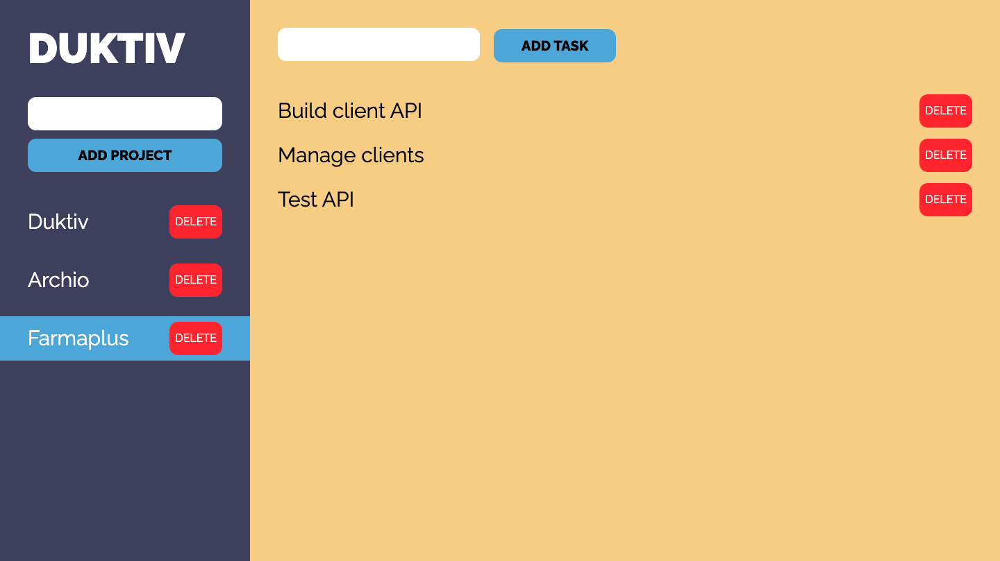

# DUKTIV

Installation: run `npm install` in both /client and /server directory.

How to run:
1. Go to /server directory, create a .env file with MONGO_DB_URI variable in it to specify the uri to your MongoDB collection
2. Run `nodemon server.js`
3. Go to /client directory, run `npm run dev`
4. Your project manager app is up in your local server!
